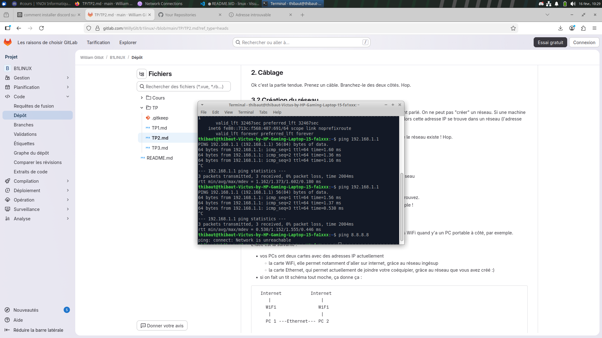

# B1 Linux - TP2

## I. Exploration locale en solo

## II. Exploration locale en duo
- 1. Cablage effectué

- 2. Création du réseau

- 3. Modification d'adresse IP
bien effectuée:

- 4. Utilisation d'un des deux comme gateway

j'ai decidé de prendre Antonin comme duo pour ce TP, ici ce sera lui qui jouera le role de gateway pendant que moi je joue le role du pc qui n'a plus internet.

je peux bien ping antonin :

et voilà bien un ping 8.8.8.8 qui fonctionne sans carte WiFi :

- 5. Petit chat privé
je suis sur linux donc j'ai deja netcat, et la communication depuis le port 8888 est bien effectuée : 

- 6. Wireshark

voici ce qu'il se passe dans mon wireshark quand Antonin me ping : 

voici ce qu'il se passe dans mon wireshark quand Antonin netcat : 

- 7. Firewall 