# RENDU TP – Administration SSH et Serveur Web Nginx

Prénom : Antonin
Nom : Russo

## Partie 1 – Mise en place de l’environnement virtualisé

### 1. Vérification de l'ip a la VM :

Commande utilisée : 

```bash
$ ip a
```

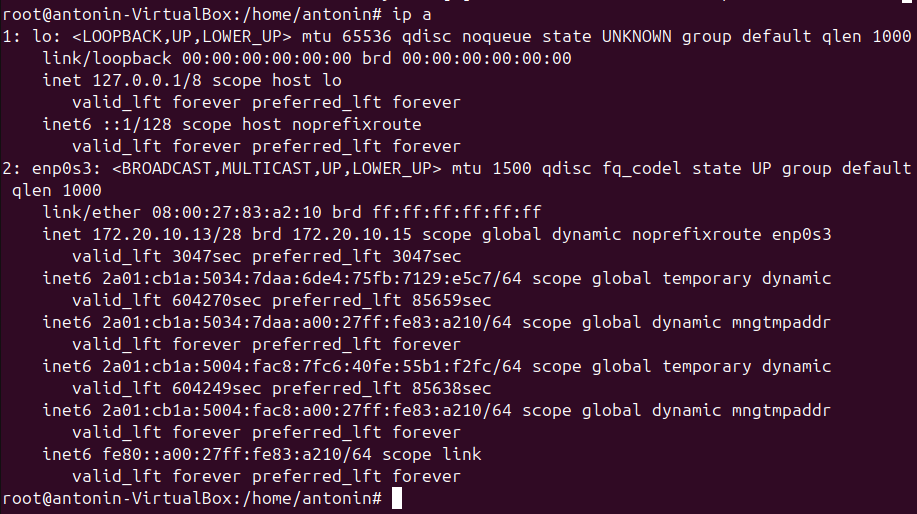

### 2. Vérifiez que la VM a une IP accessible depuis la machine hôte.  

Commande utilisée depuis la machine hôte :

```bash
$ ping 172.20.10.13
```

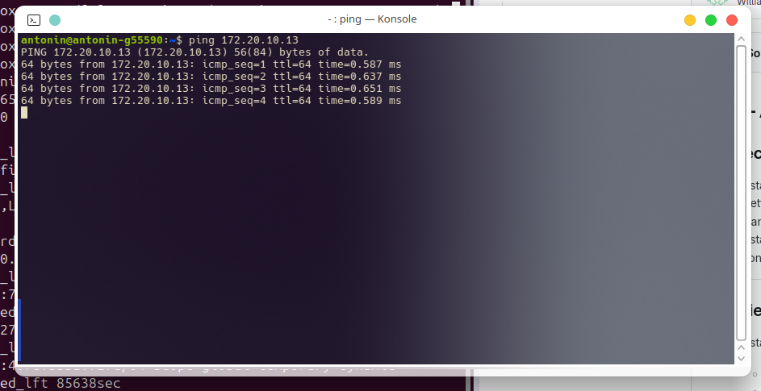

---

## Partie 2 – Serveur SSH

### 1. Installez le serveur SSH sur la VM.  

Commande utilisée :

```bash
$ apt install openssh-server
```

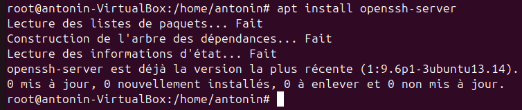

### 2. Vérifiez que le service SSH fonctionne et écoute sur un port.  

Commande utilisée :

```bash
$ systemctl status ssh
```

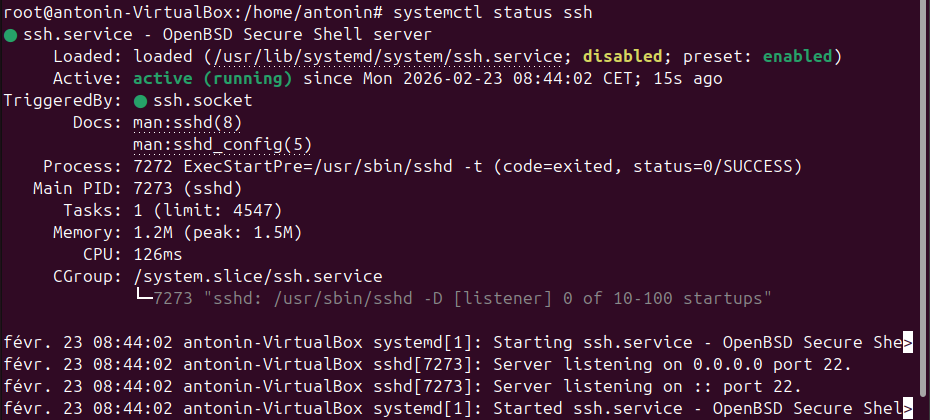

On observe bien "Active: active (running)".

### 3. Connectez-vous depuis la machine hôte : 

Commande utilisée :

```bash
$ ssh etudiant@<IP_VM>
```

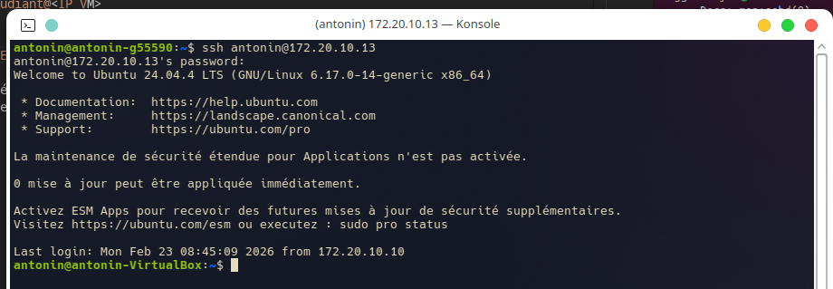

### 4. Générez une clé SSH sur la machine cliente et copiez-la sur le serveur pour tester la connexion sans mot de passe.

Commande utilisée pour générer une clé SSH :

```bash
$ ssh-keygen -A
```

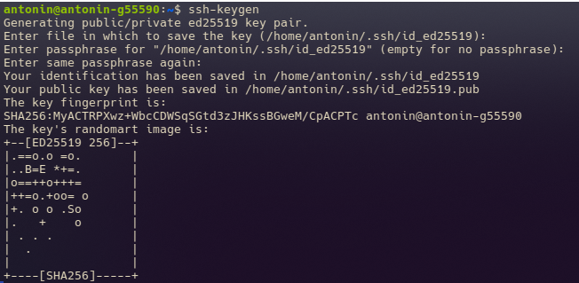

Commande utilisée pour tester la connexion sans mot de passe :

```bash
$ ssh-copy-id antonin@172.20.10.13
```

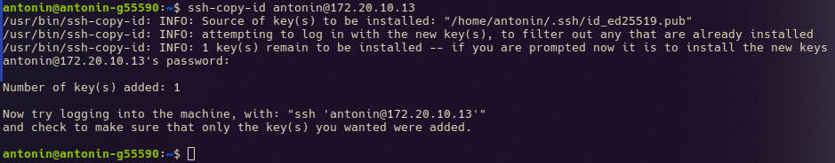

## Partie 3 – Sécurisation SSH

Commande utilisée pour modifier configuration SSH sur le serveur pour renforcer la sécurité :

```bash
$ nano /etc/ssh/sshd_config
```

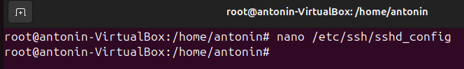

### Modification de la configuration pour :

- Interdire l'accès root
- Désactivez l'authentification par mot de passe
- Changez le port par défaut pour 2222

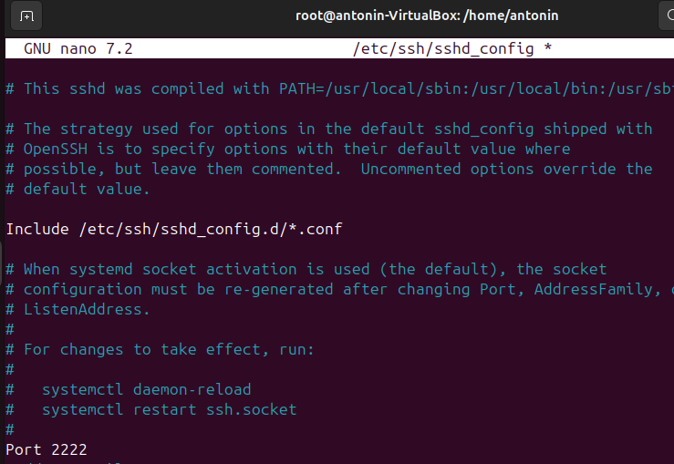
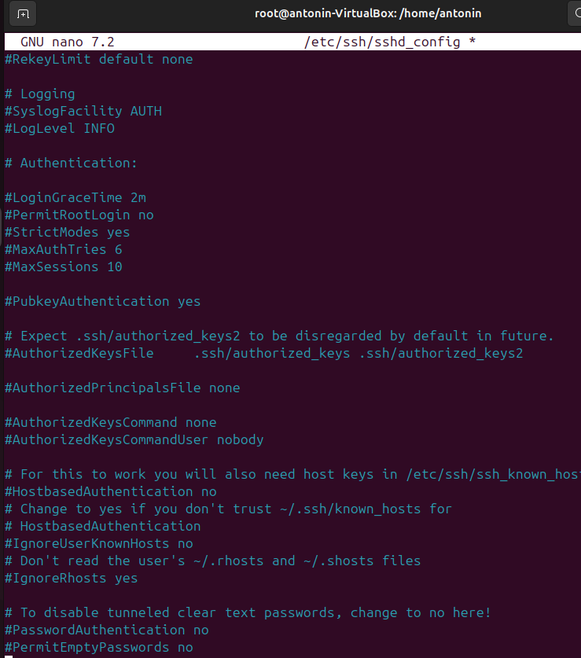

### Ensuite on redémarre le service SSH :

Commandes utilisées :

```bash
$ systemctl restart ssh.socket
$ systemctl restart deamon-reload
$ systemctl restart ssh

# On vérifie que le serveur écoute sur le bon port avec la commande ss -tulpn
$ ss -tulpn | grep ssh
```

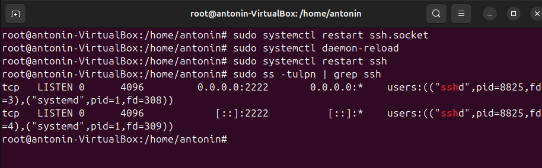

### Maintenant on teste la connexion depuis le pc hôte :

- Avec l'utilisateur non root :

Commande utilisée :

```bash
$ ssh -p 2222 antonin@172.20.10.13
```

On précise 2222 car on a changé le port par défaut

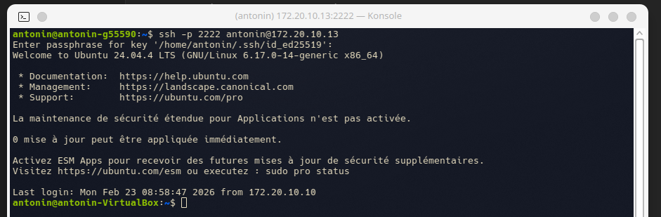

- Avec l'utilisateur root :

Commande utilisée :

```bash
$ ssh -p 2222 root@172.20.10.13
```

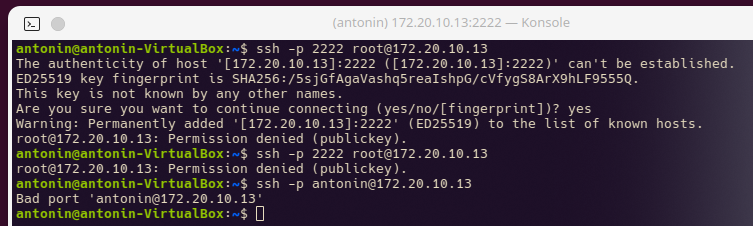

On observe qu'on est pas autorisé à se connecter.
Jai aussi testé en se connectant avec le port par défaut et on observe que le port par défaut (22) a été désactivé.

### On crée un alias SSH pour simplifier les connexions :

Commandes utilisées :

``` bash
$ nano ~/.ssh/config

$ ssh vm # <-- pour s'y connecter simplement
```

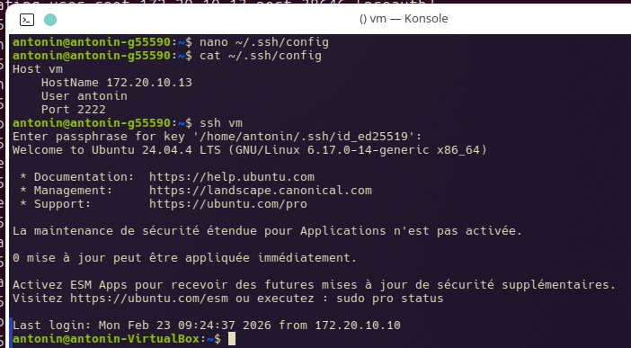

## Partie 4 – Transfert de fichiers

### Méthode SCP

Transférez un fichier et un dossier depuis la machine cliente vers le serveur :

- Fichier :

Commande utilisée sur le pc hôte :

```bash
$ pwd # <-- vérification du répertoire actuel
$ touch fichier.txt # <-- je crée un fichier à déplacer
$ scp -P 2222 fichier.txt antonin@172.20.10.13:/home/antonin # <-- /home/antonin, représente le chemin de destination
```

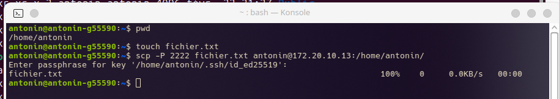

Ensuite, côté client on observe :

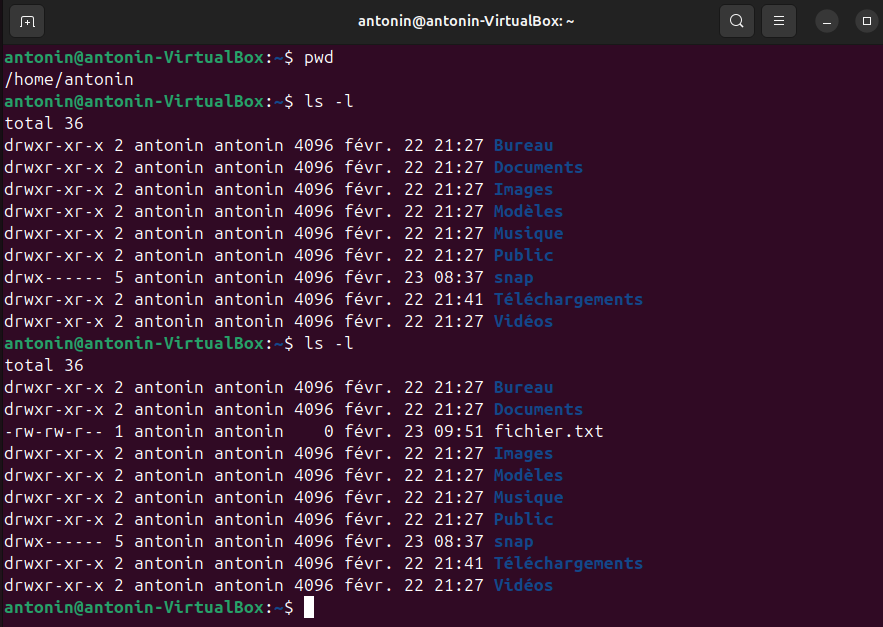


- Dossier :

Commande utilisée sur le pc hôte :
On fait de même :

```bash
$ scp -P 2222 mon_dossier antonin@172.20.10.13:/home/antonin
```

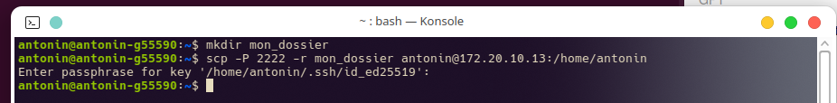

Puis, on observe bien notre dossier transféré sur le client :

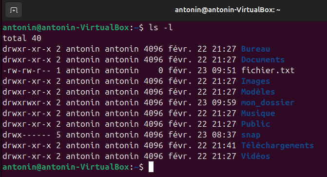

### Méthode SFTP (Secure File Transfer Protocol)

On pourrait faire de même avec SFTP :

Sur mon pc hôte :

```bash
$ sftp -P 2222 antonin@172.20.10.13
```

Une fois connecté je peux faire :

```bash
$ ls # <-- voir les fichiers serveur
$ put fichier # <-- envoyer un fichier
$ get # <-- télécharger un fichier
```

Sinon je peux aussi utiliser `Termius`, `WinSCP` ou `FileZilla` pour avoir une interface interactive pour transférer des fichiers/dossiers.

### Méthode RSYNC

On peut aussi synchroniser des fichiers/dossiers avec la commande rsync.

On pourrait faire :

```bash
$ rsync -avz -e "ssh -p 2222" mon_dossier/ antonin@172.20.10.13:/home/antonin
```

- `-a` -> archive (garde les permissions, dates, etc.)
- `-v` -> verbose (affiche les logs, détails)
- `-z` -> compression
- `-e` -> précise la commande SSH et mon port modifié précedemment

## Partie 5 – Analyse des logs et sécurité

- Suivez les logs d’authentification pour observer les connexions SSH :  
```bash
sudo tail -f /var/log/auth.log
```

### Installation Fail2Ban

Commandes utilisées :

```bash
$ sudo apt install fail2ban
$ sudo systemctl status fail2ban
```

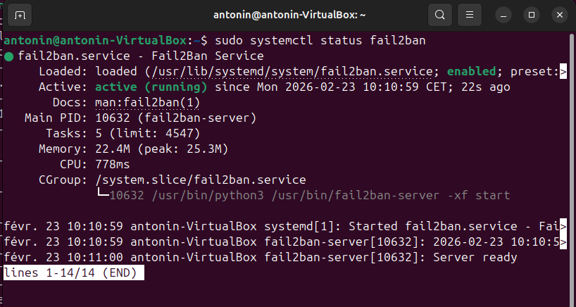

Ensuite on configure le banissement puis on redémarre le service fail2ban :

```bash
$ sudo nano ...
$ sudo systemctl restart fail2ban
```

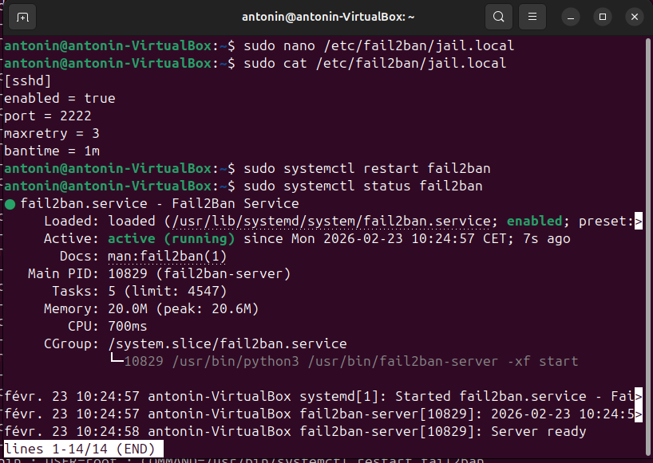


### Test bannissement & unban

On essaye de se connecter à la VM en utilisant un mot de passe éronné 3 fois.

On observe qu'à la 4ème tentative, nous sommes bloqués et nous ne pouvons plus nous connecter.

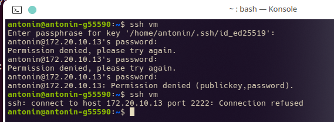

Ensuite, on observe avec la commande suivante que notre ip a bien été bannie : 

```bash
$ sudo fail2ban-client status sshd
```

Je peux aussi me débannir avec la commande :

```bash
$ sudo fail2ban-client set sshd unbanip MON_IP
```

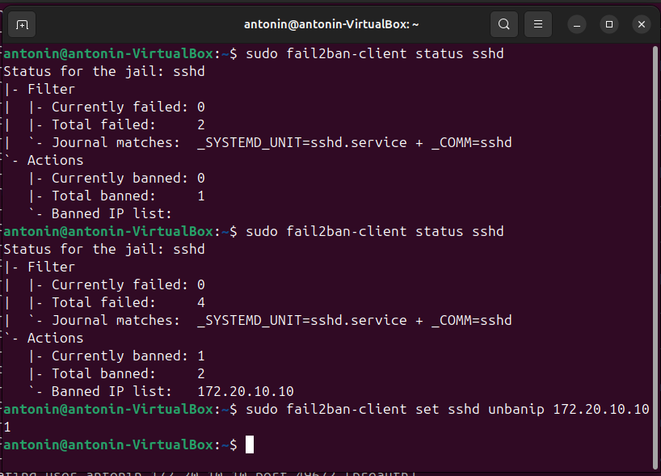

On observer aussi c'est le auth.log mes connexions réfusées.

Commande utilisée :

```bash
$ sudo tail -f /var/log/auth.log
```

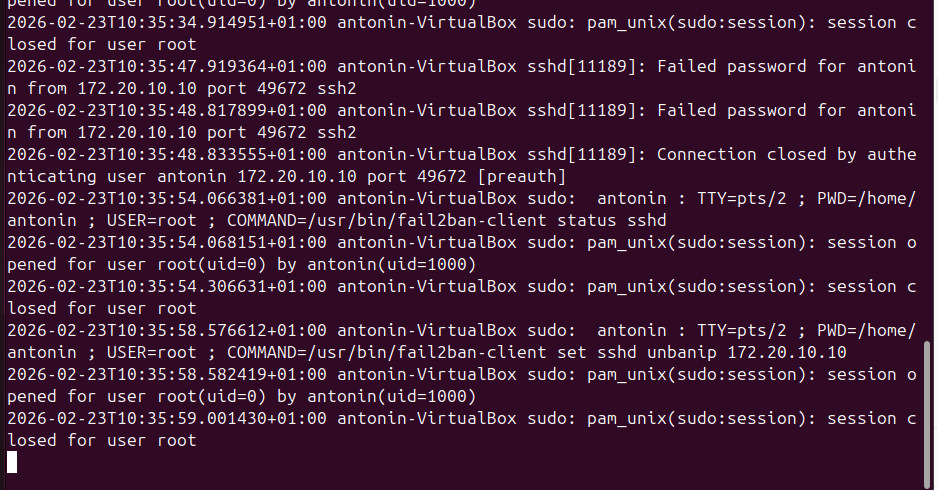


## Partie 6 – Tunnel SSH

### Création d'un tunnel local pour accéder à un service web distant depuis la machine cliente.

Commande utilisée :

```bash
$ ssh -L 8080:localhost:80 -p 2222 antonin@172.20.10.13
```

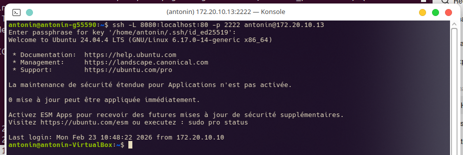

Maintenant quand on va sur notre navigateur web en dehors de la VM sur l'url `http://localhost:8080` :

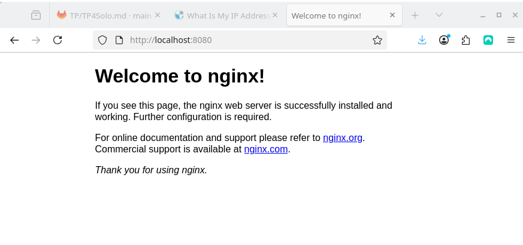

Maintenant on va inverser le flux pour accéder à un service qui tourne sur le client (mon pc kubuntu) sur la machine serveur (VM ubuntu).

### Création d'un tunnel distant pour permettre l’accès SSH au client via le serveur.

On commence par ouvrir un serveur web sur mon pc avec python.

Commande utilisée :

```bash
$ python3 -m http.server 8000
```

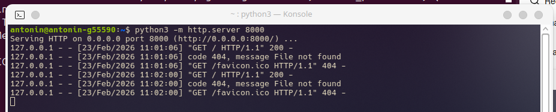

Ensuite on ouvre le serveur distant et on établie la connexion avec la VM.

Commande utilisée :

```bash
$ ssh -R 9090:localhost:8000 -p 2222 antonin@172.20.10.13
```

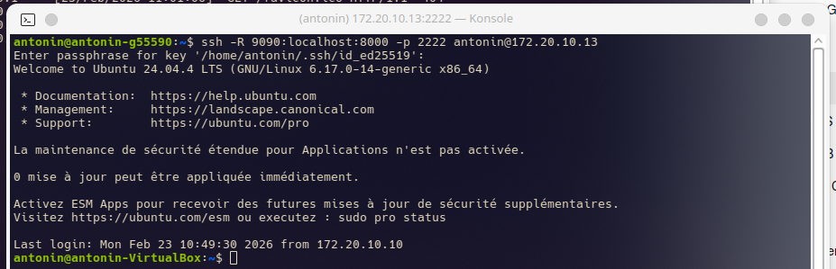

Puis, on ouvre le navigateur sur la VM, on se rend à l’adresse `http://localhost:9090` et on observe que le tunnel a bien été établi.

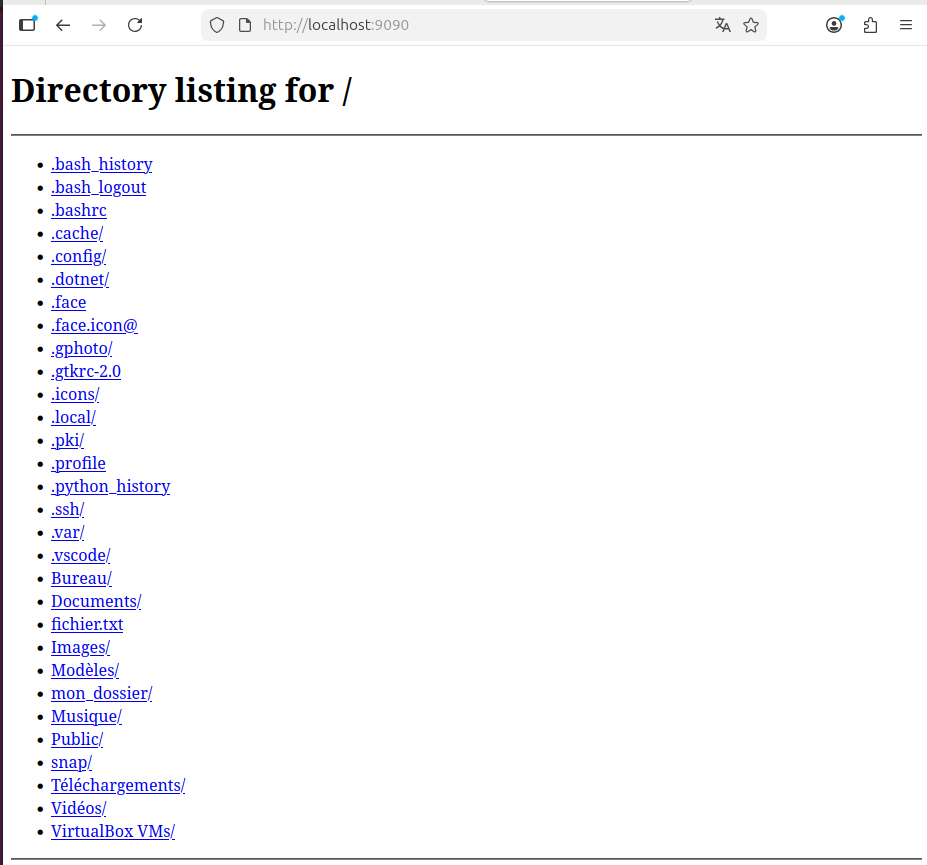

## Partie 7 – Nginx et HTTPS

### Installation de Nginx :

Commande utilisée :

```bash
$ sudo apt install nginx
```

Puis vérification que le service nginx marche :

```bash
$ systemctl status nginx
```


### Création d'un site

Je crée un fichier `index.html` dans le répertoire `/var/www/site-tp`.

Commandes utilisées :

```bash
$ cd /var/www
$ ls
$ sudo mkdir site-tp
$ cd site-tp
$ nano index.html
```

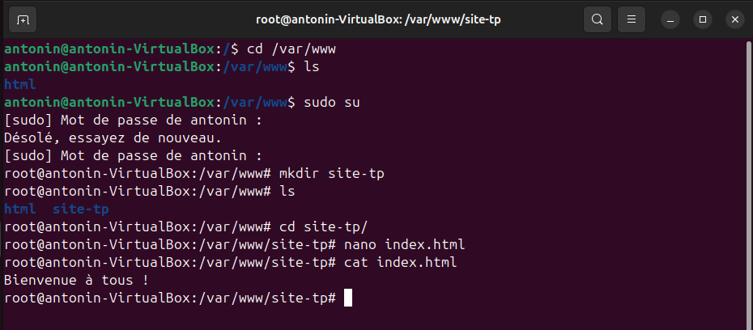

### Configuration de Nginx pour servir ce site sur HTTP.

Commandes utilisées :

```bash
$ nano /etc/nginx/sites-available/site-tp # <-- on modifie le fichier de configuration
$ ln -s /etc/nginx/sites-available/site-tp /etc/nginx/sites-enabled # <-- on crée une redirection dans sites-enabled (sites en production) pour pointer sur notre fichier de configuration
$ rm /etc/nginx/sites-enabled/default # <-- on supprime le site par défaut en production (/var/www/html)
$ nginx -t # <-- on test la configuration nginx avant de le redémarrer
$ systemctl restart nginx # <-- on redémarre nginx
```

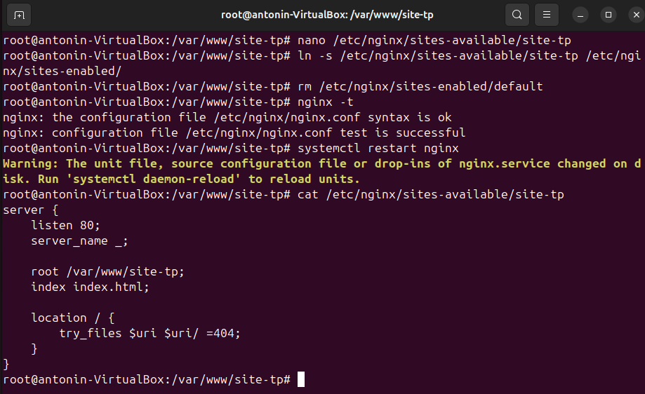

Maintenant, je peux accéder depuis mon pc hôte kubuntu au site de ma VM sur l'url `http://172.20.10.13` :

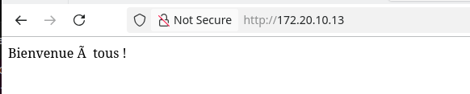

### Génération d'un certificat auto-signé pour HTTPS et configuration de la redirection HTTP → HTTPS

Commandes utilisées :

```bash
$ sudo openssl req -x509 -nodes -days 365 -newkey rsa:2048 -keyout /etc/ssl/private/site-tp.key -out /etc/ssl/certs/site-tp.crt

# La commande ci-dessus sert à générer le certificat auto-signé.

$ sudo nano /etc/nginx/sites-available/site-tp

# On modifie la configuration actuelle pour utiliser le https avec le certificat auto-signé.
```

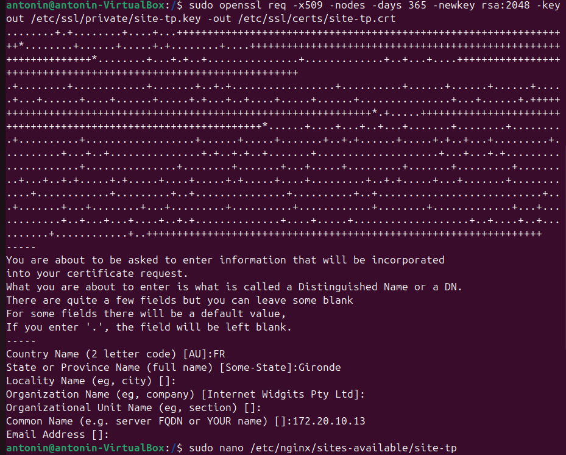

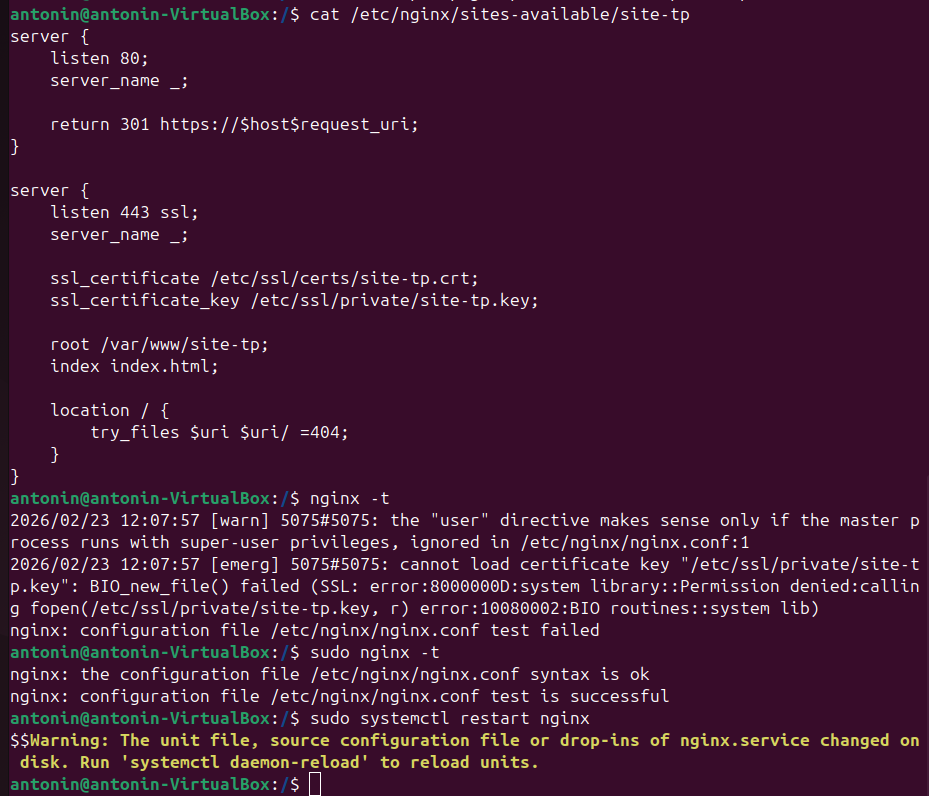

Ensuite :

```bash
# On test la configuration nginx avec :
$ sudo nginx -t

# Puis on redémarre nginx avec :
$ sudo systemctl restart nginx
```

Enfin, on termine par essayer le ping avec curl depuis mon pc kubuntu : 

```bash
$ curl -k https://172.20.10.13/
```

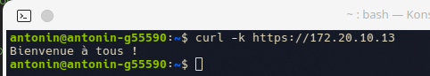

## Partie 8 – Firewall et permissions

### Configuration du firewall avec ufw.

- Autorisation de Nginx dans le firewall (ports HTTP/HTTPS)
- Vérification des permissions sur /var/www/site-tp pour que Nginx puisse lire les fichiers.

Commandes utilisées :

```bash
$ ufw status
# On voit que le firewall est désactivé

$ ufw allow 'Nginx Full'
# On autorise Nginx dans le firewall

$ ufw enable
# On active le firewall (pare-feu)

$ ufw status
# Le firewall est bien activé avec nos règles établies

$ ls -l /var/www
# On affiche les permissions du dossier /var/www

$ chown -R www-data:www-data /var/www/site-tp
$ chmod -R 755 /var/www/site-tp
# On donne les permissions à Nginx d'accéder à notre site
```

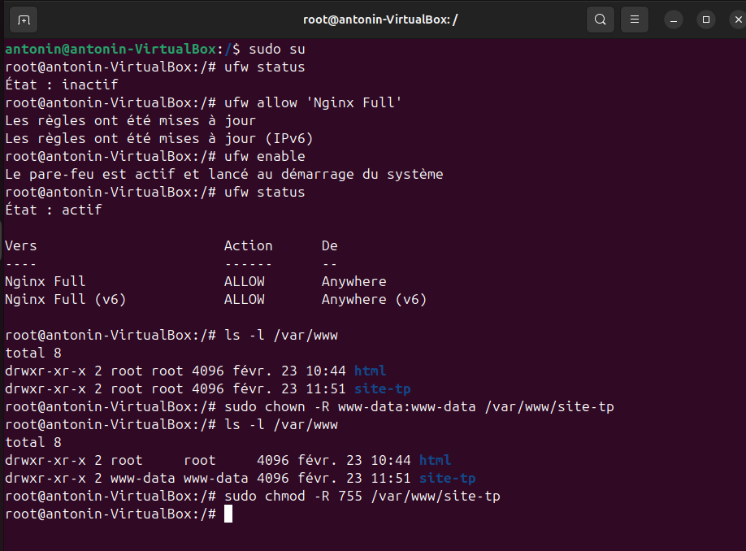

Enfin, tout marche correctement et seuls les ports 80 et 443 sont ouverts !

## Partie 9 – Validation finale -> OK 

- [x] **SSH** fonctionnel sur port personnalisé et authentification par clé uniquement.  
- [x] **Fail2Ban** actif et opérationnel.  
- [x] **Transferts de fichiers** fonctionnels (SCP, SFTP, RSYNC).  
- [x] **Nginx** accessible en HTTP et HTTPS avec redirection automatique HTTP → HTTPS.  
- [x] **Certificat SSL** auto-signé valide.  
- [x] **Firewall** configuré et **permissions** correctes sur `/var/www/site-tp`.
