# TP5 : pfSense – Bases d’un pare-feu

# Partie 1 – Prise en main et sécurisation

## 1. Accès à l’interface

Connexion à l’interface web de pfSense.

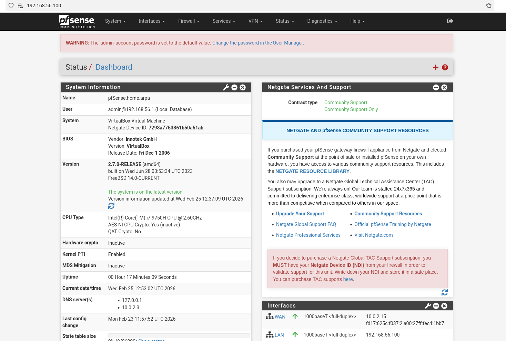

### Questions :

- Quelle est l’adresse IP du LAN  ?
> L'adresse ip du LAN est 192.168.56.100. C'est l'adresse pour accéder à l'interface web depuis mon réseau LAN.

- Quelle est l’adresse IP du WAN ?
> L'adresse ip du WAN est 10.0.2.15.

- Pourquoi utilise-t-on HTTPS ?
> On utilise HTTPS pour HTTP + le chiffrement SSL/TLS. Sans HTTPS, l'interface web ne serait pas sécurisée alors que le pare-feu est un équipement critique dans un réseau. Donc le mot de passe admin serait clairement visible et interceptable sur le réseau.

- Pourquoi faut-il changer les identifiants par défaut sur un pare-feu ?
> Il faut changer les identifiants par défaut sur un pare-feu car ils sont publics et connus de tout le monde étant donné que pour pfSense, c'est un pare-feu open source, on retrouve les identifiants sur internet. Ainsi, quelqu'un pourrait compromettre le pare-feu, s'y connecter et l'administrer.

## 2. Sécurisation de l’accès administrateur

Modifiez les paramètres du compte administrateur.

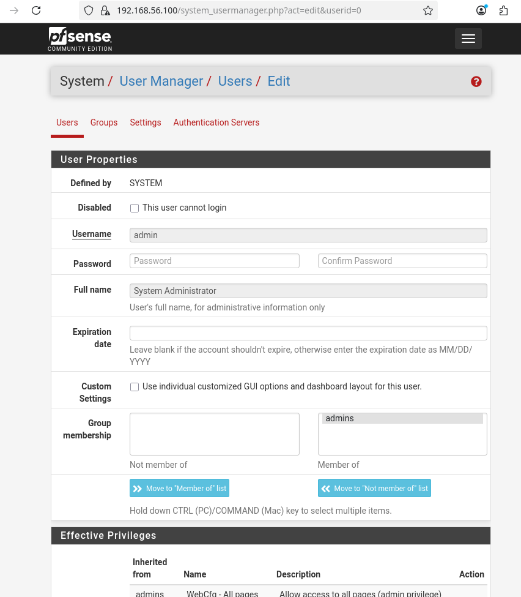

### Questions :

- Où se gèrent les utilisateurs ?
> Les utilisateurs se gèrent dans : System -> User Manager

- Qu’est-ce qu’un mot de passe robuste ?
> Un mot de passe robuste c'est : minimum 12 caractères, majuscules, miniscules, chiffres, symboles, pas d'infos perso, aléatoire...

- Pourquoi sécuriser en priorité l’accès admin sur un équipement réseau ?
> On sécurise en priorité l'accès admin sur un équipement réseau car c'est le point d'entrer pour avoir accès au pare-feu et donc administrer le réseau. L'admin peut modifier les règles du pare-feu, rediriger le trafic, voler des données... Ainsi, si le compte administrateur est compris, toutes les machines derrière sont exposées.

# Partie 2 – Comprendre les interfaces réseau

## 3. Vérification des interfaces

Vérifiez l’affectation WAN / LAN.

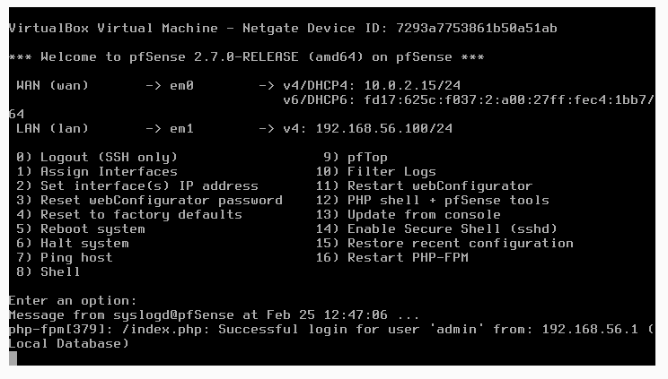

### Questions :

- Quelle interface permet l’accès Internet ?
> L'interface qui permet l'accès Internet est WAN (em0). L'ip est 10.0.2.15 et le réseau correspond au NAT de VirtualBox.

- Quelle interface correspond au réseau interne ?
> L'interface qui correspond au réseau interne est LAN (em1). L'ip est 192.168.56.100 et correspond au réseau Host-Only de VirtualBox. Elle va servir à connecter ma VM ubuntu à internet.

- Que se passerait-il si les interfaces étaient inversées ?
> Si les interfaces étaient inversées, le réseau interne serait exposé et ne passerai pas par le pare-feu. Ainsi, le trafic sortira mal et donc c'est un problème de sécurité.

# Partie 3 – Configuration des services réseau

## 4. DHCP

Configurez le serveur DHCP pour le réseau LAN.

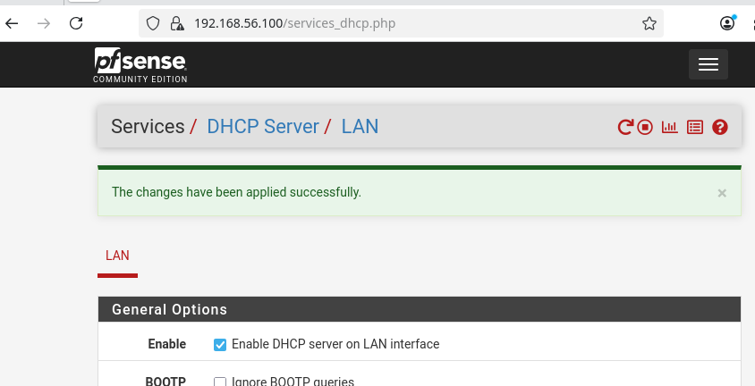

### Questions :

- Pourquoi utiliser DHCP plutôt qu’une IP fixe ?
> DHCP permet d'attribuer une adresse ip automatiquement. Si je devais utiliser une ip fixe, je devrais configurer chaque machine à la main. Donc si en entreprise j'ai 200 PC, ça serait long et aussi j'aurais pas de conflits d'IP.

- Quelle plage d’adresses choisir ?
> Puisque mon LAN est 192.168.56.100, je peux choisir une plage entre 192.168.56.1 et 192.168.56.254.

- Quelles adresses faut-il éviter d’inclure dans la plage ?
> Je ne dois pas inclure l'ip du pare-feu (192.168.56.100) et les ip que je veux garder pour plus tard.

### Vérification :

- Ubuntu obtient-elle automatiquement une adresse IP ?
> Oui

Commandes utilisées pour vérification :

```bash
$ ip a
$ ip route
```

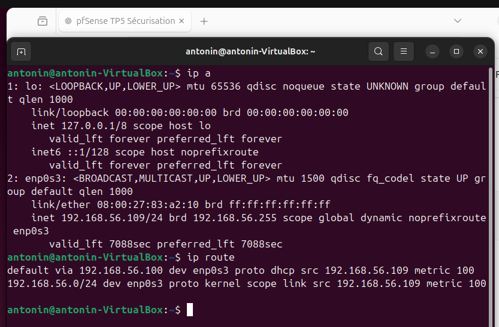


## 5. DNS

Activation et configuration du résolveur DNS.

Je vais dans `Services -> DNS Resolver` puis que je clique sur `Enable DNS Resolver` puis sur `Save`.

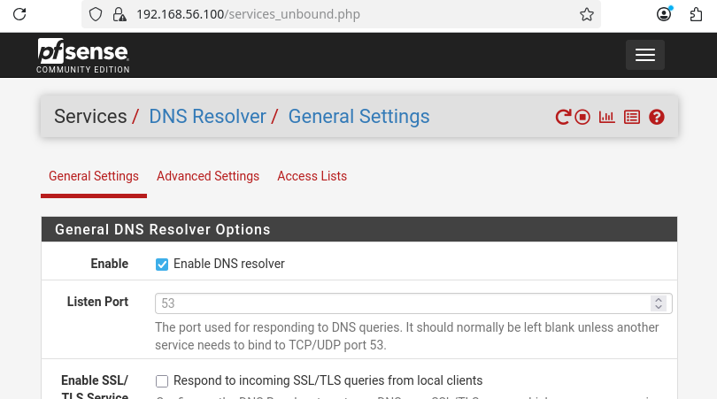

### Questions :

- Pourquoi un pare-feu peut-il jouer le rôle de serveur DNS ?
> Il peut relayer les requêtes DNS vers internet, il peut bloquer des sites, il peut filtrer certains domaines. Par exemple, le réseau d'Ynov bloque certains sites etc.

- Que se passe-t-il si le DNS ne fonctionne pas mais que le ping vers 8.8.8.8 fonctionne ?
> Si le DNS ne fonctionne pas que le ping vers 8.8.8.8 fonctionne alors, internet fonctionne, mais la résolution de nom est cassée et le problème vient uniquement du DNS. En gros internet marche mais seulement en adresse ip.

# Partie 4 – Autoriser l’accès Internet

## 6. Règles de pare-feu

Configuration des règles nécessaires pour permettre aux machines du LAN d’accéder à Internet.

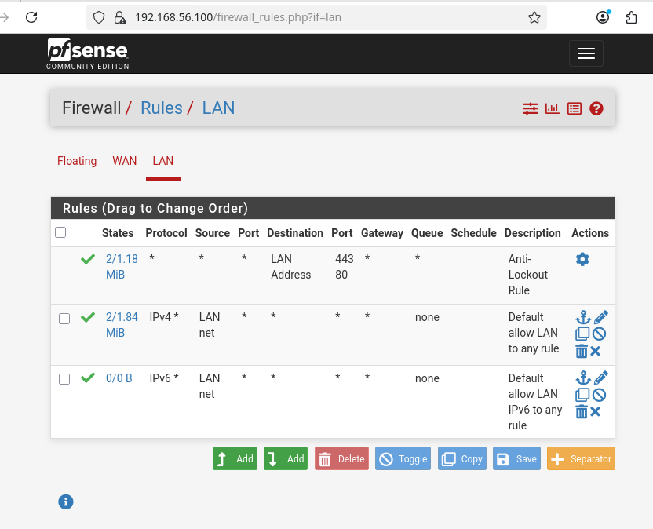

### Questions :

- Quelle doit être la source ?
> La source doit être LAN net.

- Quelle doit être la destination ?
> La destination doit être Any, parce que mes VM doivent pouvoir accéder à Internet, DNS externes et des serveurs distants.

- Faut-il autoriser tous les protocoles ?
> Oui pour un lab simple. Mais sinon en entreprise on peut se limiter seulement à HTTP (80), HTTPS (443).

### Tests :

- Ping vers pfSense  
- Ping vers 8.8.8.8  
- Test DNS  
- Accès web  

Commandes utilisées :

```bash
$ ping 192.168.56.100
# Ping vers pfSense

$ ping 8.8.8.8
$ ping google.com
```

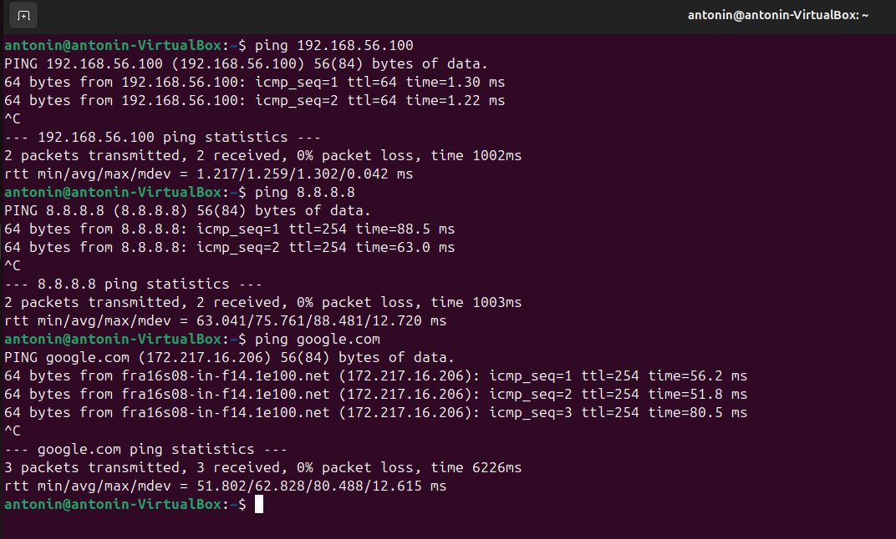

### Si ça ne fonctionne pas :

- Où regarder ? (Logs ? NAT ? Règles ?)
> Il faudrait d'abord regarder les règles LAN du pare-feu. Puis de regarder les logs système du firewall.

## 7. NAT

Vérifiez la configuration du NAT sortant.

### Questions :

- Pourquoi le NAT est-il nécessaire avec une interface WAN en NAT ?
> Le NAT est nécessaire car les adresses 192.168.56.x sont privées et elles ne sont pas accessibles depuis Internet.

- Quelle est la différence entre NAT automatique et manuel ?
> En NAT automatique, pfSense crée les règles NAT tout seul pour les réseaux internes.
> 
> En NAT manuel, c'est moi qui crée chaque règle. Et je peux mettre des règles spécifiques, j'ai un contrôle total...

- Comment vérifier qu’une traduction d’adresse a lieu ?
> Il faut aller dans pfSense, Status -> System Logs -> Firewall

# Partie 5 – Filtrage

## 8. Blocage d’un site spécifique

Bloquer l’accès à un site web 
On va bloquer le site `example.com`.

Je me rend dans `Firewall` -> `Aliases` puis cliquer sur `Add`.

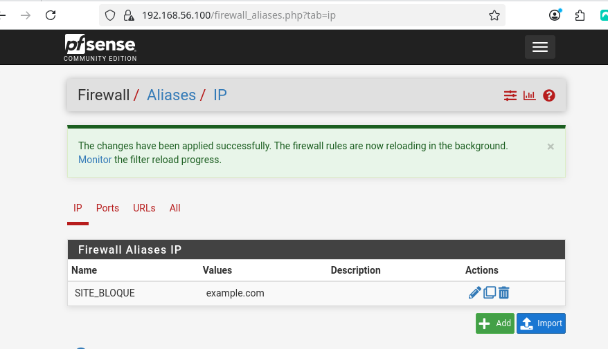

Ensuite, je vais dans `Firewall` -> `Rules` -> `LAN` -> `Add`, je mets : 

```bash
Action : Block
Interface : LAN
Protocol : TCP
Source : LAN net
Destination : Alias → SITE_BLOQUE
Port : 80 (HTTP)
Port : 443 (HTTPS)
```

Et j'obtiens :

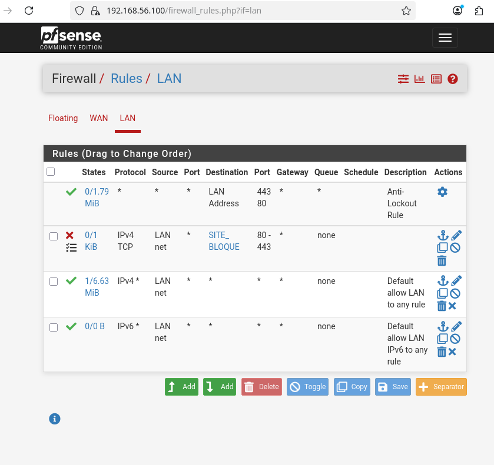

### Questions :

- Faut-il bloquer par IP ou par nom de domaine ?
> Il faut bloquer par nom de domaine car les sites peuvent utiliser plusieurs IP, aussi, les IP peuvent changer et un hébergeur peut héberger plusieurs sites donc il faut bloquer le point d'entrée (nom de domaine).

- Que se passe-t-il si le site utilise HTTPS ?
> Si le site utilise HTTPS, le contenu est chiffré, le pare-feu ne voit pas le contenu et il voit seulement l'ip de destination. Donc il faut aussi bloquer le port 443.

- Pourquoi le blocage par IP peut-il être contourné ?
> Le blocage par IP peut être contourné car une ip peut héberger plusieurs domaines, le site peut changer d'ip, les sites utilisent des CDN (ex: Cloudflare)... Un utilisateur peut utiliser un VPS etc.

Test et observation des logs.

Commandes utilisées :

```bash
$ curl https://example.com/
```

Ensuite dans pfSense je vais dans `Status` -> `System Logs` -> `Firewall` et j'observe un ligne Block avec ma VM ubuntu. Le blocage marche bien.

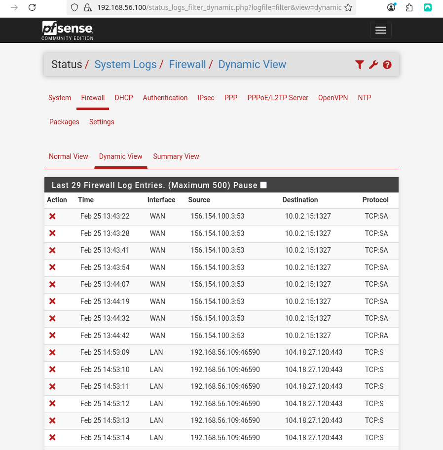


## 9. Blocage d’une catégorie de sites (jeux d’argent)

Création d'une solution propre et maintenable pour bloquer plusieurs sites.

Création de l'alias :

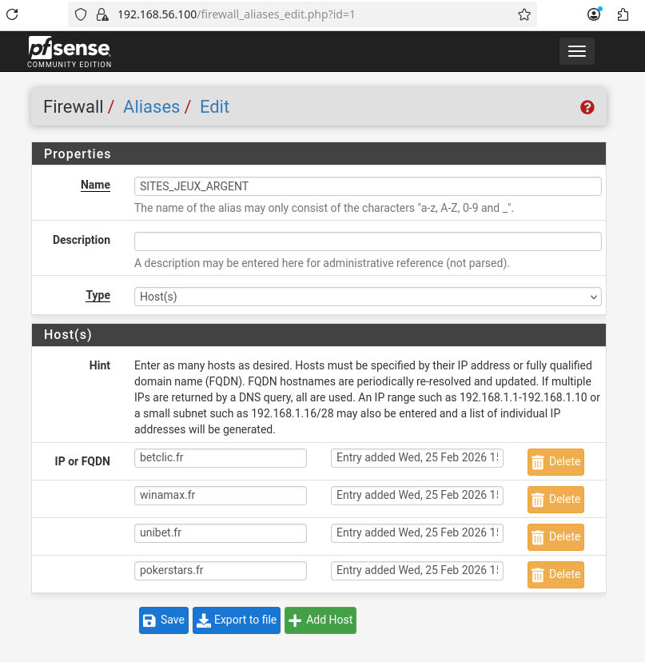

Création de la règle avec l'alias :

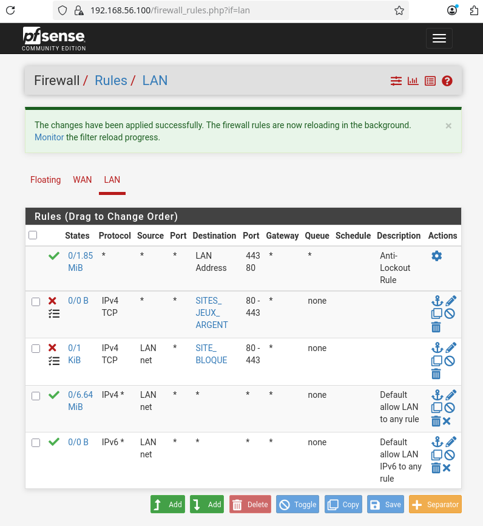

### Questions :

- Pourquoi ne pas créer une règle par site ?
> On ne crée pas une règle par site car ce n'est pas maintenable, ça peut devenir illisible et à grande échelle c'est impossible à gérer.

- Où se créent les alias ?
> Les aliases se créent dans Firewall -> Aliases.

- Comment vérifier qu’une règle bloque réellement le trafic ?
> Pour vérifier qu'une règle bloque réellement le trafic, on va dans Status -> System Logs -> Firewall (comme ce que j'ai fais ci-dessus).

# Partie 6 – Aller plus loin (partie plus tendue)


## 10. Blocage par catégorie (réseaux sociaux)

- Créez un alias pour une nouvelle catégorie.  

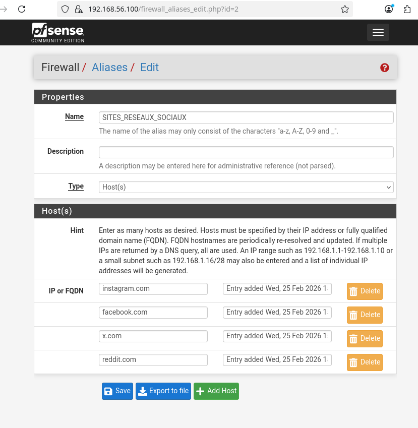

- Implémentez une règle. 

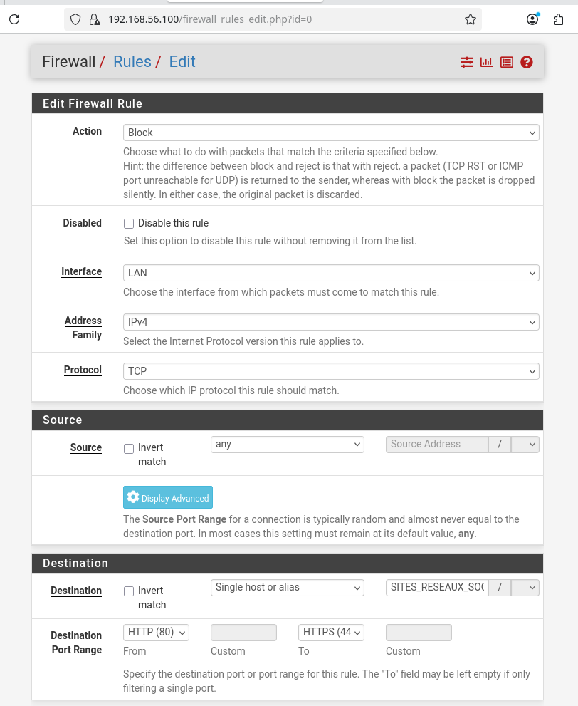

- Analysez les logs.  

### Question :

Que se passe-t-il si la règle est placée sous une règle "Pass Any" ?
> Si la règle est placée sous une règle "Pass Any", alors elle ne sert à rien parce que pfSense lit les règles de haut en bas. Et donc si "Pass Any" passe au-dessus, le trafic sera autorisé et il n'y aura pas de blocage.


## 11. Règles horaires

- Créez un horaire.

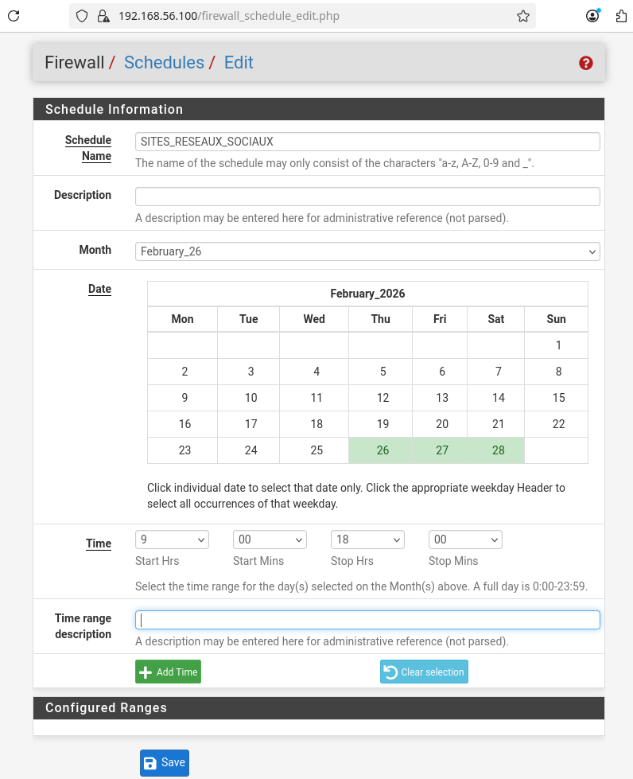

- Appliquez-le à une règle existante.

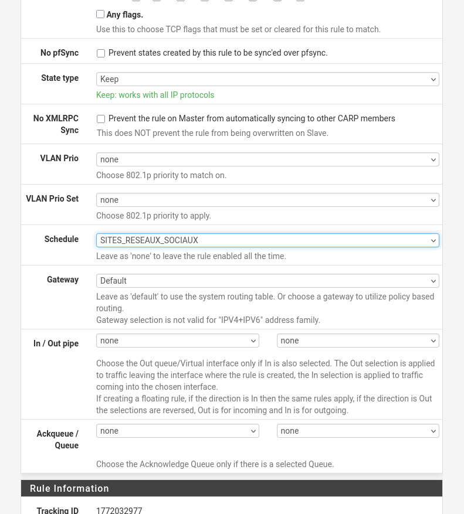

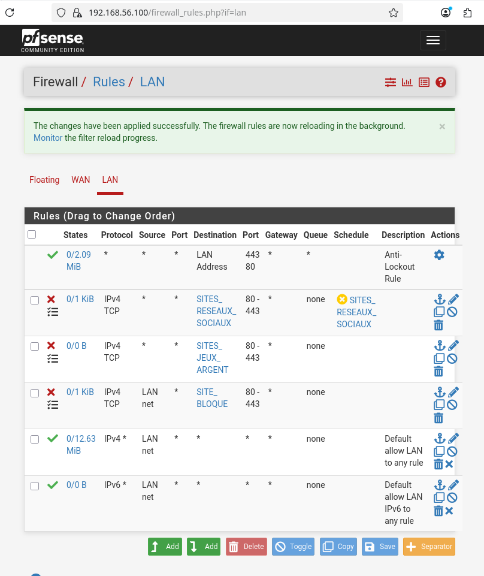

### Questions :

Pourquoi les règles horaires sont-elles utiles en entreprise ?
> Les règles horaires sont utiles en entreprise car ça permet de bloquer les réseaux sociaux pendant les heures de travail, limiter l'accès Internet et par exemple interdire Internet en dehors des heures de travail pour éviter tout potentiel débordements ou autre. Donc les horaires permettent un contrôle dynamique sans modifier les règles.


## 12. Serveur web local

Installation d'un serveur web sur Ubuntu.

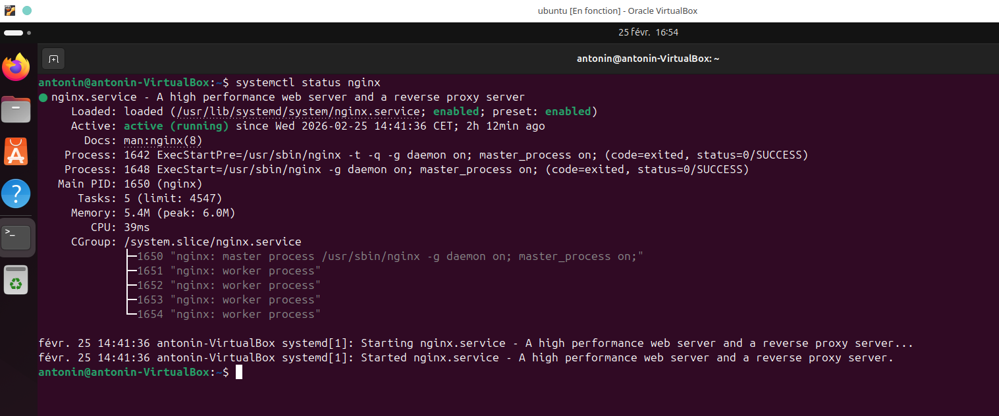

### Objectifs :

- Autoriser un accès spécifique  
- Bloquer les autres  

### Questions :

- Filtrer par IP source ?
> Oui

- Filtrer par port ?
> Oui

- Pourquoi le pare-feu protège-t-il le LAN même en réseau interne ?
> Le pare-feu protège le LAN même en réseau interne car il contrôle tout le trafic entre les machines, il filtre les flux internes. Et notamment, sans pare-feu interne, un PC infecté peut attaquer les autres.


## 13. Logs et analyse

Activez la journalisation sur certaines règles.

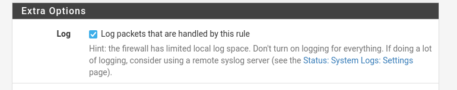

### Questions :

- Différence entre paquet bloqué et autorisé
> Un paquet bloqué, le trafic est rejeté et un paquet autorisé, le trafic est autorisé.

- Identifier quelle règle a déclenché le blocage  


- Comprendre le sens du trafic  


## 14. DMZ

Mettez en place une zone DMZ.

### Questions :

- Qu'est ce qu'une DMZ ?
> Une DMZ est une zone démilitarisée qui est une zone du réseau isolée pour une partie accessible publiquement, notamment serveurs web, mail...

- Pourquoi isoler un serveur ?
> On isole un serveur car s'il est compromis, il doit ne pas pouvoir accéder au LAN et ça permet de limiter les dégats.

- Une machine en DMZ peut-elle accéder au LAN ?
> Non

- Le LAN peut-il accéder librement à la DMZ ?
> Oui

## 15. Filtrage MAC

Testez le filtrage par adresse MAC.

### Question :

- Le filtrage MAC est-il réellement sécurisé ?
> Le filtrage MAC n'est pas réellement sécurisé.

- Pourquoi est-il facilement contournable ?
> Car une adresse MAC peut être changée facilement et elle est visible seulement localement.

## 16. Portail captif

Implémentez un portail captif.

Création du portail :

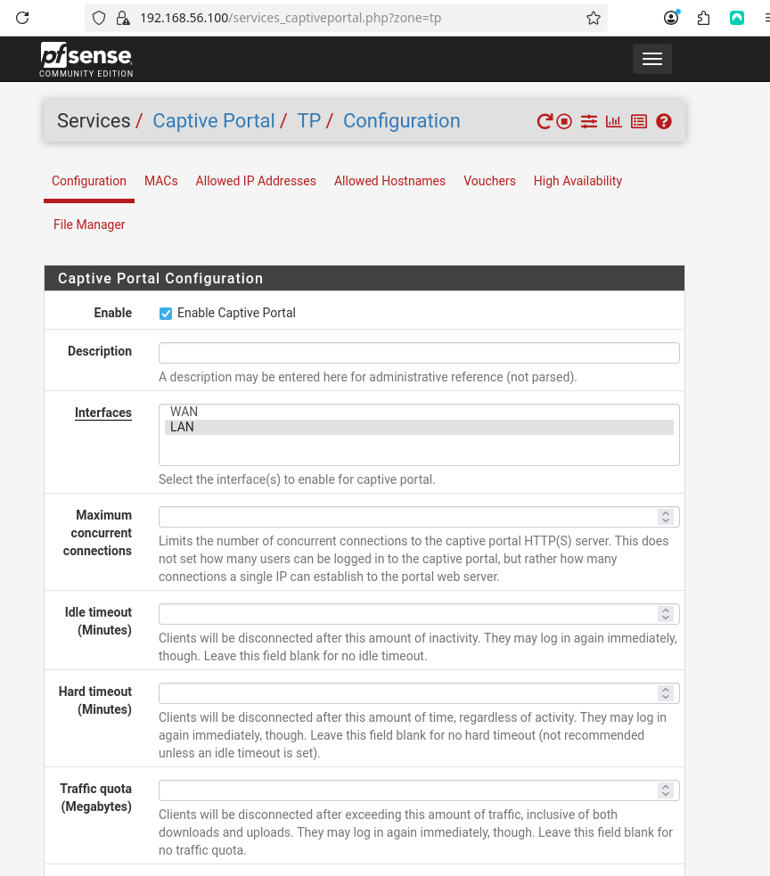

Connexion au portail :

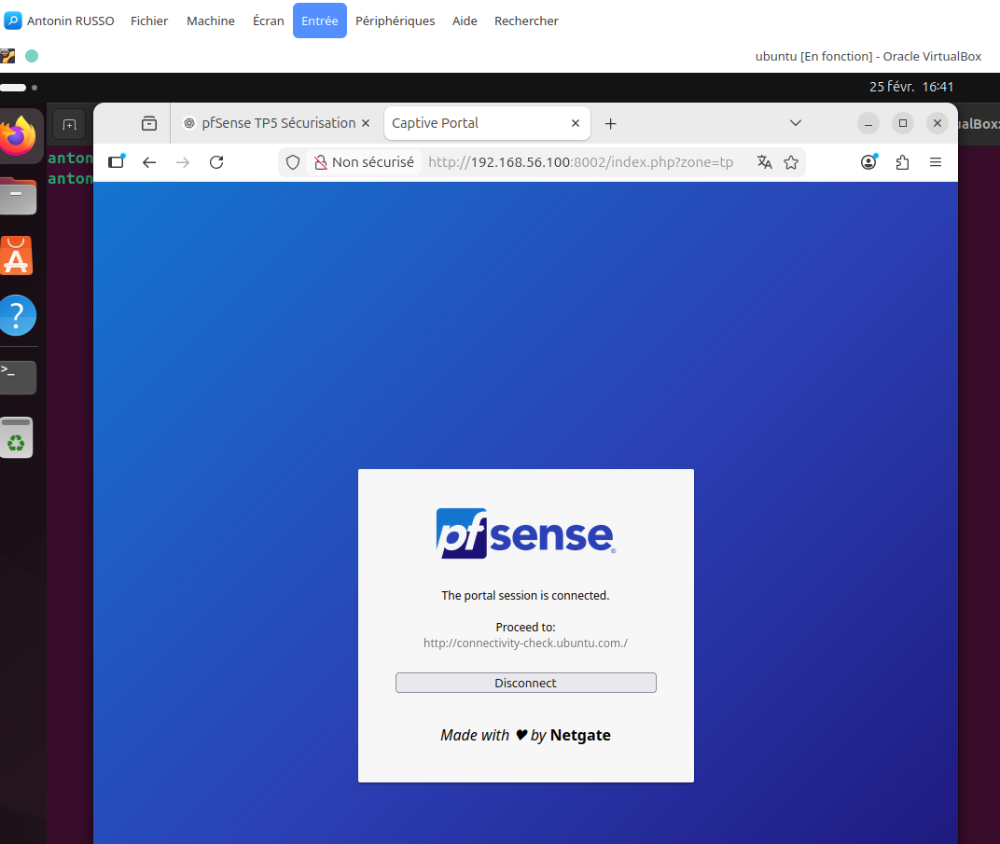

### Questions :

- Dans quels contextes utilise-t-on cela ?
> On utilise un portail captif dans un contexte d'hôtels, d'aéroports, écoles, entreprises...

- Quelle(s) avantage(s) avec une simple règle de pare-feu ?
> Un portail captif permet de contrôler les utilisateurs, d'avoir des logs par utilisateur. Le portail est un moyen de contrôle + avancé avec + de suivi sur qui fait quoi.
