# TP RENDU -- Mise en place d'un serveur OpenVPN sur Ubuntu Server
À l'issue de ce TP, vous devrez être capables de :
-   Installer et configurer OpenVPN sur Ubuntu Server
-   Mettre en place une infrastructure de certificats (PKI)
-   Comprendre le rôle du NAT et du routage IP
-   Générer un profil client fonctionnel
-   Diagnostiquer un service système en échec
# Mise en place
Vous devez mettre en place :
-   D'une VM Ubuntu Server LTS
-   D'un réseau NAT
-   Maintenant qu'on sait faire des connexions SSH, ca serait dommage de se priver

# Préparation du système
-   Mettre à jour le système

Commandes utilisées :

```bash
$ sudo apt update && sudo apt upgrade -y
```

- Installer les paquets nécessaires : openvpn et easy-rsa

Commandes utilisées :

```bash
$ sudo apt install openvpn easy-rsa -y
# On met -y pour accepter l'installation des dépendances

$ openvpn --version
# On vérifie que openvpn est installé
```

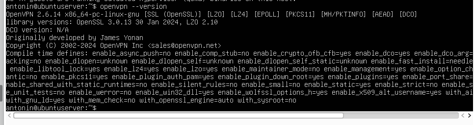

# Partie 1 : Comprendre la PKI
### Questions

1.  À quoi sert une autorité de certification (CA) ?
> Une autorité de certification sert à signer les certificats pour garantir l'identité. Elle permet de prouver que mon serveur VPN est bien mon serveur. C'est une autorité de confiance comme CertBot, Let's Encrypt...

2.  Quelle différence entre clé privée et certificat ?
> La différence entre une clé privée et un certificat est qu'une clé privée est secrète et ne doit jamais être partagée, elle sert à signer/déchiffrer. Alors que le certificat est public, il contient la clé publique, il est signé par le certificat d'autorité et sert à prouver mon identité.

3.  Pourquoi un serveur VPN a-t-il besoin de certificats ?
> OpenVPN a besoin de certificats car il fonctionne en TLS et il faut authentifier le serveur, les clients et chiffrer les échanges.

# Création de l'infrastructure Easy-RSA

-   Créer un environnement PKI

-   Générer :
    -   Une CA
    -   Un certificat serveur

    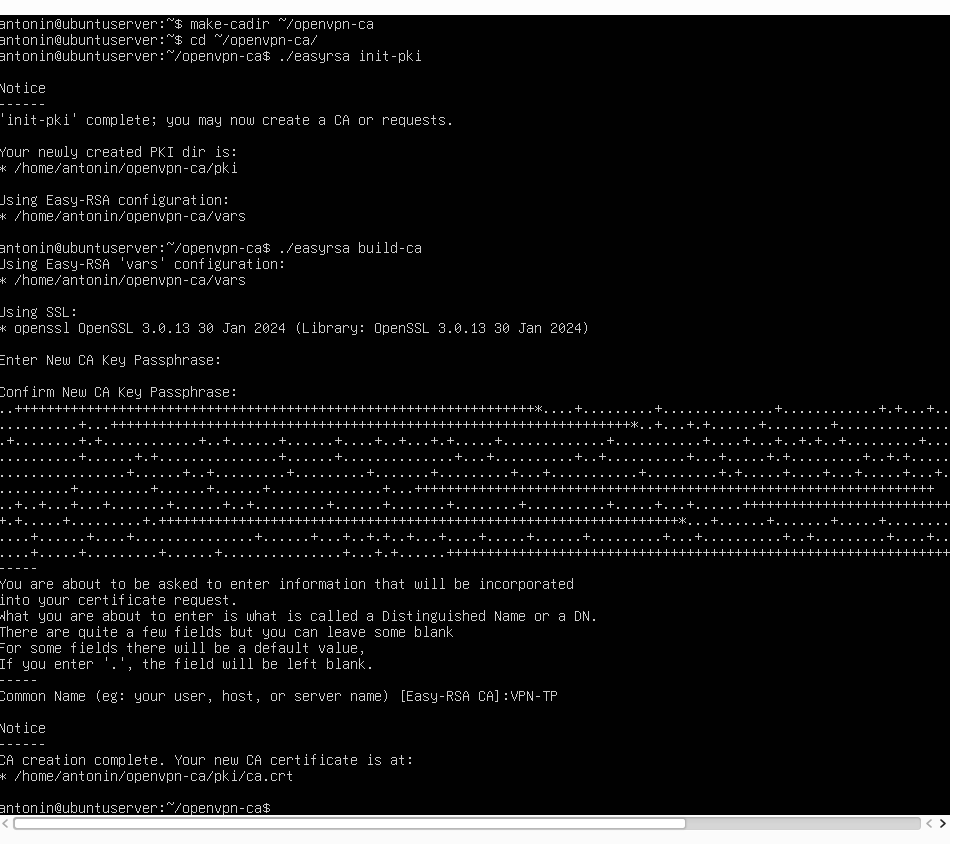
    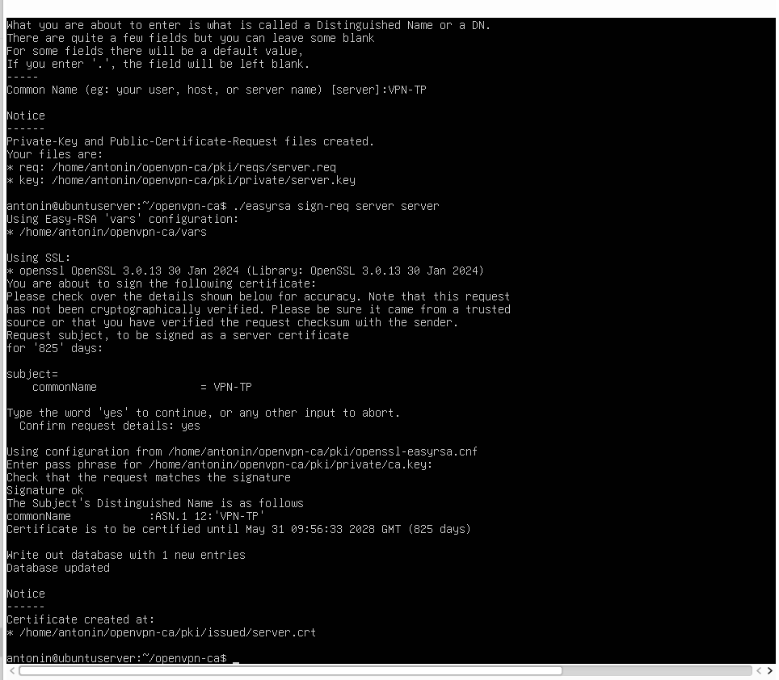

    -   Un certificat client

    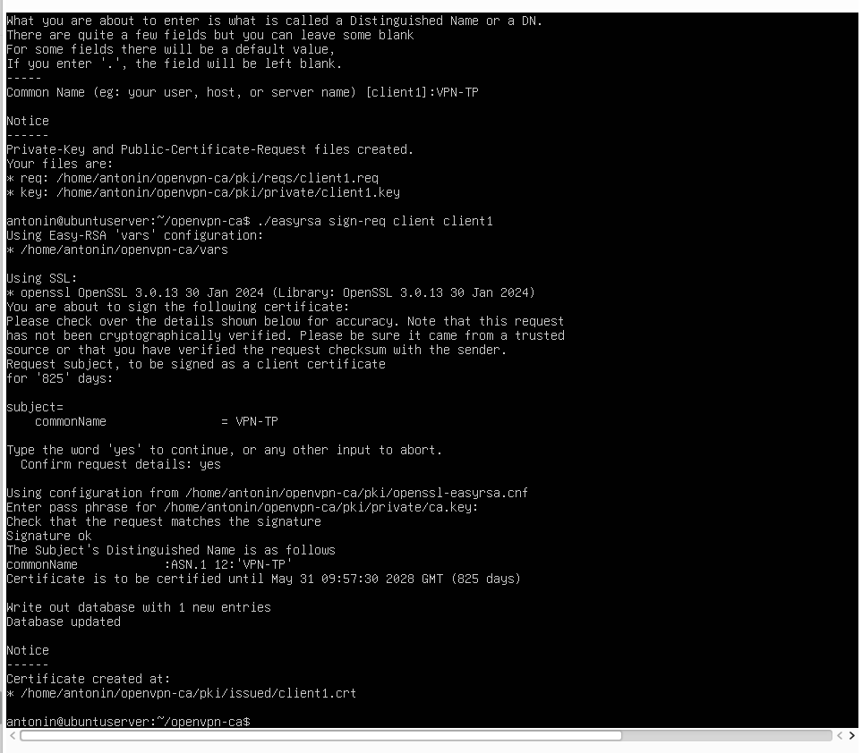

    -   Les paramètres Diffie-Hellman
    -   Une clé TLS supplémentaire

    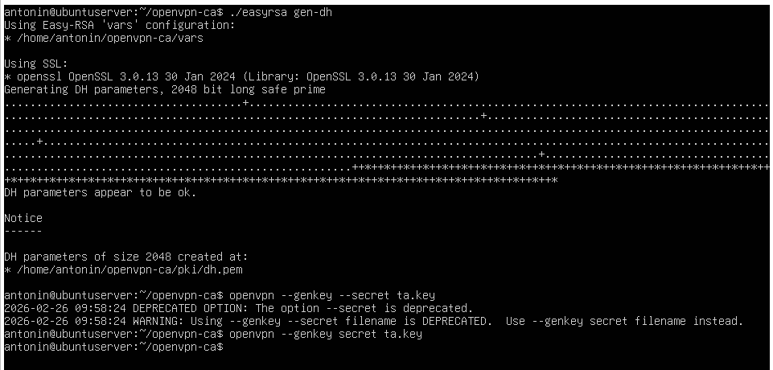

### Questions : 

-   Où Easy-RSA crée-t-il ses fichiers ?
-   Que contient le dossier `pki/` ?
-   Quelle est la différence entre `gen-req` et `sign-req` ?
-   Que se passe-t-il si vous oubliez de signer un certificat ?

# Partie 2 : Configuration du serveur OpenVPN

Créer un fichier de configuration serveur.
`/etc/openvpn/server/server.conf`

Commande utilisée :

```bash
$ sudo nano /etc/openvpn/server/server.conf
```

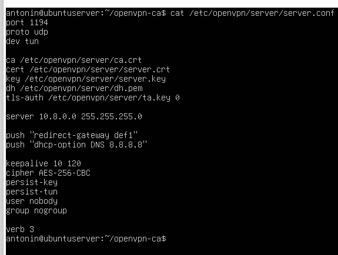

### Éléments attendus

-   Port d'écoute
-   Protocole
-   Interface virtuelle
-   Réseau attribué aux clients
-   Références aux certificats

### Questions : 

-   Que signifie `dev tun` ?
> dev tun signifique qu'on crée une interface virtuelle de niveau 3. Et tun pour tunnel ip.

-   Quelle est la différence entre UDP et TCP pour un VPN ?
> 

-   Quelle plage IP choisir pour le VPN ? Pourquoi ?
> Pour le VPN on peut choisir la plage IP 10.8.0.0 (celle par défaut) car c'est une plage privée et elle ne doit pas rentrer en conflit avec LAN et le réseau NAT de VirtualBox

# Routage et NAT

-   Activer le forwarding IP

Commande utilisée :

```bash
$ sudo nano /etc/sysctl.conf
```


-   Mettre en place une règle NAT pour avoir l'accès internet depuis le vpn

Commandes utilisées :

```bash
$ ip a

$ sudo iptables -t nat -A POSTROUTING -s 10.8.0.0/24 -o enp0s3 -j MASQUERADE
```

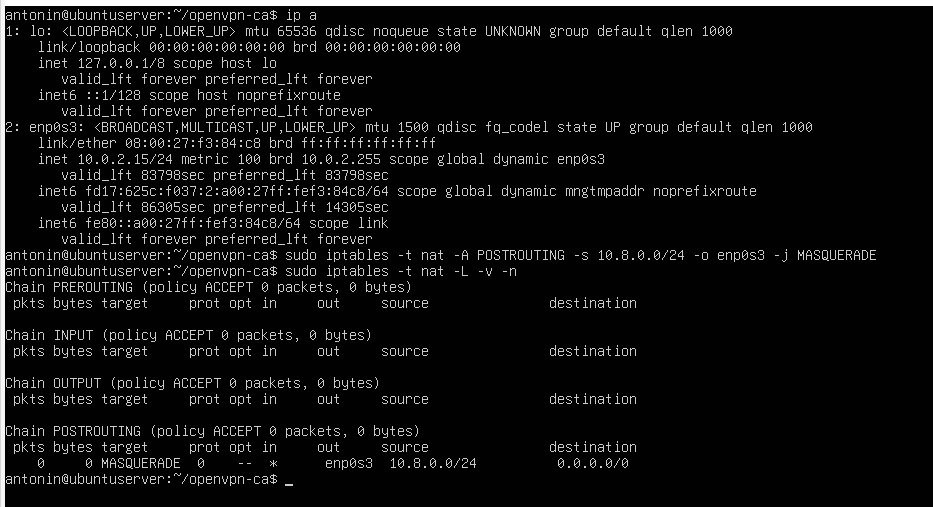

### Questions : 

-   Où se configure le paramètre `ip_forward` ?
> Le paramètre ip_forward se configure dans /etc/sysctl.conf

-   Quelle commande permet d'afficher les règles NAT actuelles ?
> La commande : $ sudo iptables -t nat -L -v -n

-   Pourquoi faut-il "masquerader" le réseau VPN ?
> Il faut masquerader le réseau VPN car le réseau 10.8.0.0/24 est privé et Internet ne sait pas comment répondre à ce réseau.


# Démarrage et analyse du service

-   Démarrer le service OpenVPN

Commandes utilisées :

```bash
$ sudo systemctl start openvpn-server@server
# Démarrer le service
```

-   Vérifier son état

```bash
$ sudo systemctl status openvpn-server@server
# Voir l'état du service
```

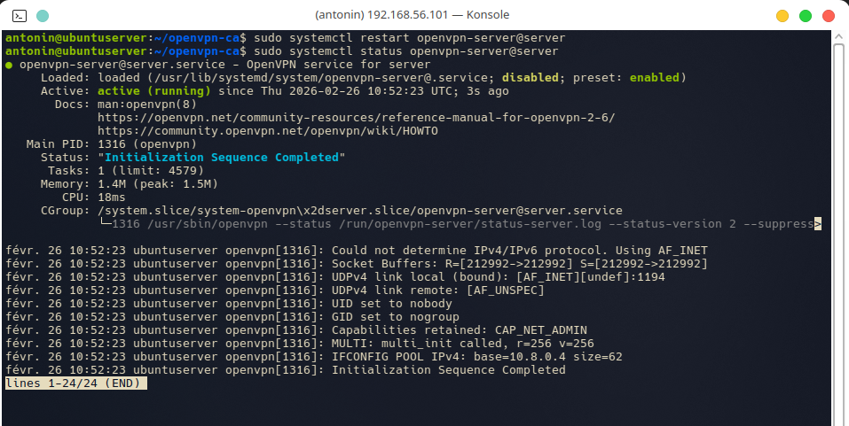

### Si le service échoue :

-   Quelle commande permet d'afficher les logs système d'un service ?
> La commande qui permet d'afficher les logs système d'un service est :
```bash
$ sudo systemctl -u openvpn-server@server
```

-   Quelle est la différence entre `status` et `journalctl` ?
> La différence entre status et journalctl est que status donne l'état général du service avec un résumé rapide alors que journalctl donne les logs complets et un historique détaillé.

-   Les chemins vers les certificats sont-ils corrects ?
> Au départ, les chemins configurés dans le fichier server.conf étaient corrects, mais les fichiers de certificats n’étaient pas présents dans le répertoire /etc/openvpn/server/.
>
> Les certificats générés avec Easy-RSA se trouvent dans le dossier ~/openvpn-ca/pki/.
Ils doivent être copiés dans le répertoire indiqué dans la configuration du serveur.
>
> Une fois les fichiers déplacés vers /etc/openvpn/server/, les chemins deviennent valides et le service peut démarrer correctement.

# Partie 3 : Création du profil client

Créer un fichier `.ovpn` fonctionnel.

Commande utilisée :

```bash
$ sudo /home/antonin/client1.ovpn
```

### Éléments à inclure

-   Adresse publique du serveur
-   Certificat CA
-   Certificat client
-   Clé privée client
-   Paramètres de chiffrement
-   Authentification TLS

![]

### Questions : 

-   Comment intégrer un certificat directement dans un fichier `.ovpn` ?
> Pour intégrer un certificat directement dans un fichier .ovpn, on utilise des balises et on copie-colle directement le contenu des fichiers.

-   Pourquoi la clé privée ne doit-elle jamais être partagée
    publiquement ?
> La clé privée ne doit jamais être partagée publiquement car elle permet de se fermer passer pour le client, de déchiffrer les communications et de se connecter au VPN sans autorisation.

# Tests et validation

Vous devez être capables de :

-   Établir une connexion VPN

Commande utilisée :

```bash
$ sudo openvpn --config client1.ovpn
```

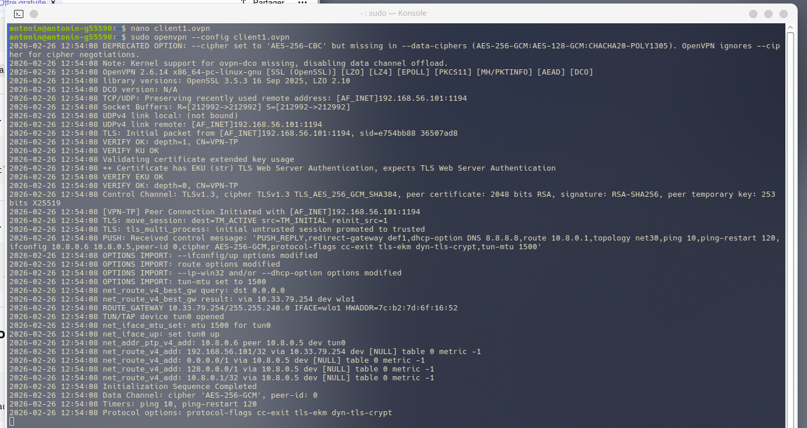

Côté serveur : 

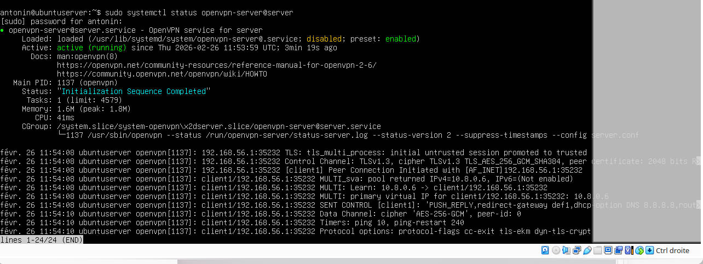

-   Vérifier l'adresse IP obtenue

Commande utilisée :

```bash
$ ip a
```

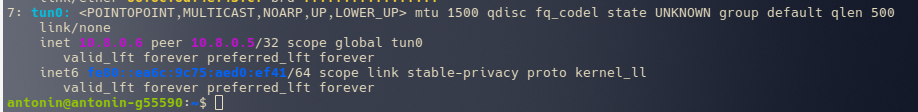

-   Vérifier l'accès Internet via le tunnel

### Questions :

-   Comment vérifier que votre trafic passe par le VPN ?
> Pour vérifier que le trafic passe par le VPN, on peut vérifier l'interface réseau tun0, utiliser curl ifconfig.me, capturer le trafic avec tcpdump et surtout vérifier l'ip publique avec ip a.

-   Que se passe-t-il si le port 1194 est bloqué ?
> Si le port 1194 est bloqué, la connexion échoue, le client ne peut pas atteindre le serveur et donc le tunnel n'est pas créé.